# WorkforceConnect AWS Deployment

A production-style cloud-hosted registration application deployed on AWS using Flask, Amazon EC2, Amazon RDS MySQL, Gunicorn, NGINX, AWS Application Load Balancer (ALB), AWS WAF, Linux, and GitHub.

---

# Project Overview

This project demonstrates a real-world cloud deployment and security workflow by hosting a Python Flask application on AWS infrastructure with persistent MySQL database storage and enterprise-style traffic protection.

The application allows users to submit registration information through a live web form, which is then stored securely in an Amazon RDS MySQL database.

The project began as a traditional AWS web application deployment during Week 2 and later evolved into a more advanced production-style cloud security architecture during Week 3.

During the Week 3 security phase of the project, several enterprise-grade AWS networking and protection services were implemented including:

- AWS Application Load Balancer (ALB)
- AWS Web Application Firewall (WAF)
- SQL Injection protection testing
- NGINX reverse proxy
- Layer 7 traffic filtering
- Target group health checks
- Security group hardening
- AWS managed protection rule groups
- Reverse proxy traffic architecture
- Production-style request routing

---

# Project Progression — Week 2 to Week 3

## Week 2 — Initial Cloud Deployment

During Week 2, the focus of the project was deploying a working cloud-hosted application using AWS infrastructure.

The initial deployment included:

- Flask registration application
- Amazon EC2 compute instance
- Gunicorn production application server
- Amazon RDS MySQL database
- Linux server administration
- AWS security groups
- Database integration
- GitHub version control
- Public application hosting

At this stage, the application was fully functional and publicly accessible, but traffic was routed directly to the EC2 instance without advanced traffic inspection or enterprise security protections.

---

## Week 3 — Security & Networking Upgrade

During Week 3, the project architecture was upgraded to simulate a more realistic production cloud environment used by cloud engineers and cloud security teams.

Major infrastructure upgrades added during Week 3 included:

### Infrastructure Upgrades
- AWS Application Load Balancer (ALB)
- AWS Target Groups
- Health check monitoring
- NGINX reverse proxy
- Improved request routing architecture

### Security Upgrades
- AWS WAF deployment
- SQL injection filtering
- Layer 7 traffic inspection
- Managed AWS security rule groups
- Request filtering
- Traffic protection policies
- Hardened security group rules
- Malicious request blocking

These upgrades significantly improved the project's:
- Security posture
- Scalability
- Traffic management
- Architecture realism
- Production deployment structure

---

# Technologies Used

## Cloud & Infrastructure
- AWS EC2
- AWS RDS MySQL
- AWS Application Load Balancer (ALB)
- AWS WAF
- AWS VPC Networking
- AWS Target Groups
- AWS Security Groups

## Backend & Application
- Flask
- Gunicorn
- NGINX
- MySQL

## Operating System & Tools
- Linux (Amazon Linux 2023)
- Git & GitHub

---

# Live Application

The WorkforceConnect application is publicly accessible through an AWS Application Load Balancer.

### WorkforceConnect Registration Form
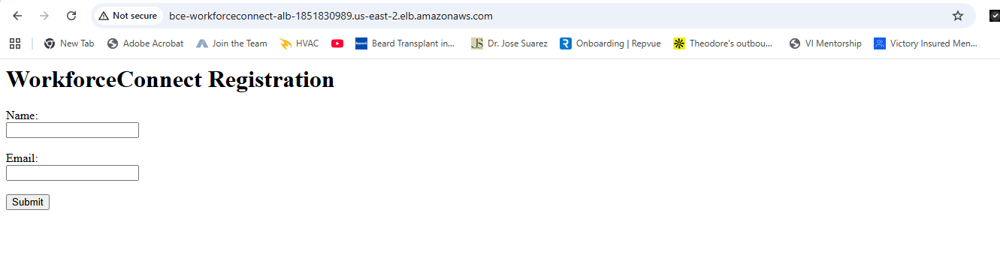

---

# Initial AWS Deployment Validation (Week 2)

These screenshots demonstrate the original AWS deployment infrastructure built during Week 2 of the project.

---

## Gunicorn Production Service Running

Gunicorn was configured as the production application server for the Flask application.

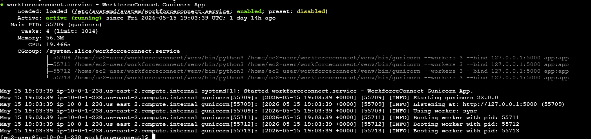

---

## AWS RDS Database Created

Amazon RDS MySQL was configured to provide persistent cloud-hosted database storage.

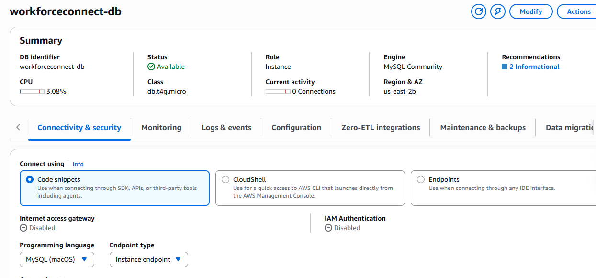

---

## Database Validation Query

Successful database connectivity validation between the Flask application and Amazon RDS MySQL.

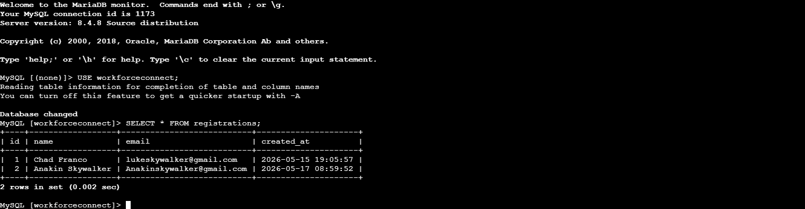

---

## GitHub Deployment Validation

GitHub repository used for source control, deployment tracking, and infrastructure documentation.

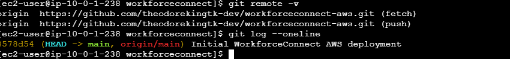

---

# Security Enhancements (Week 3)

This phase of the project focused on implementing enterprise-style security controls and production networking architecture within AWS.

Security improvements added:

- AWS Application Load Balancer (ALB)
- AWS WAF (Web Application Firewall)
- SQL Injection protection testing
- Layer 7 traffic filtering
- AWS managed security rule groups
- Target group health checks
- NGINX reverse proxy validation
- HTTP traffic control through security groups
- Production-style request routing
- Malicious request filtering
- Reverse proxy traffic management

---

# Load Balancer & Traffic Routing Validation

The following validations were performed after implementing the AWS Application Load Balancer architecture.

## Load Balancer Validation
- Verified ALB successfully routed traffic to EC2 target
- Confirmed target group health checks passed
- Verified public application accessibility through ALB DNS
- Verified NGINX reverse proxy communication
- Confirmed production-style request forwarding

---

## AWS Application Load Balancer Active

AWS ALB configured successfully and actively routing traffic to backend infrastructure.

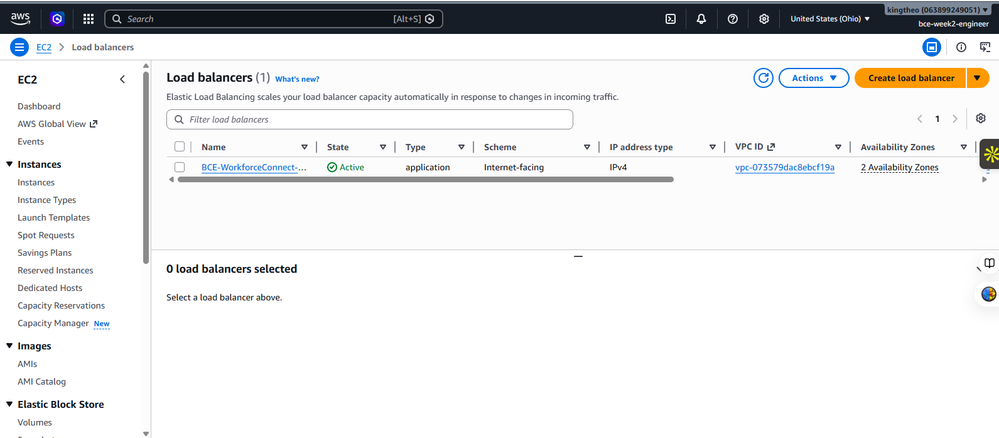

---

## Healthy Target Group Validation

AWS health checks confirmed the EC2 instance was healthy and properly communicating behind the Application Load Balancer.

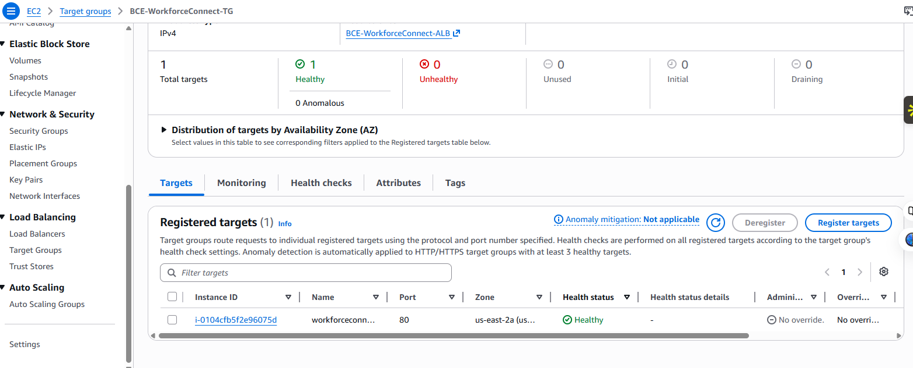

---

## NGINX Reverse Proxy Running

NGINX configured successfully as a reverse proxy between the AWS Application Load Balancer and Gunicorn application server.

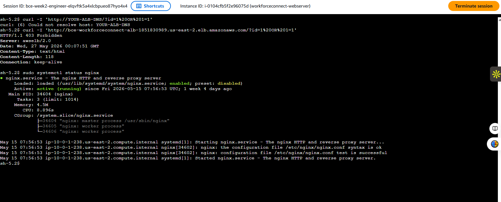

---

## Security Group Rules Configuration

Security groups configured to allow controlled inbound HTTP and SSH traffic while restricting unnecessary access.

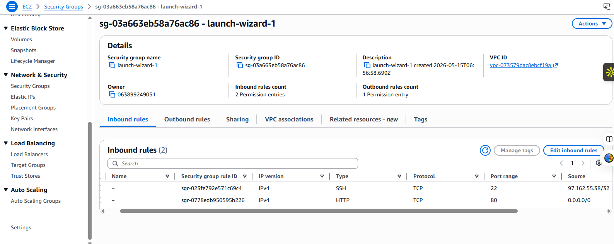

---

# AWS WAF Protection Validation

AWS WAF was deployed using AWS-managed protection rule groups to inspect and filter malicious web traffic.

The following protections were implemented:

- SQL injection filtering
- Bad input protection
- Layer 7 request inspection
- Bot traffic protection
- AWS managed DDoS protections
- Request filtering policies
- Malicious traffic blocking

---

## AWS WAF Protection Enabled

AWS WAF successfully deployed and associated with the AWS Application Load Balancer.

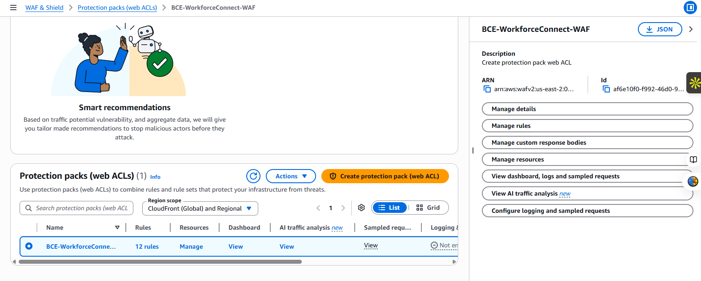

---

## SQL Injection Attempt Blocked

A simulated SQL injection-style request was tested against the application through the ALB endpoint.

Payload tested:

```bash
?id=1%20OR%201=1
```

AWS WAF successfully intercepted and blocked the malicious request by returning:

```bash
HTTP/1.1 403 Forbidden
```

This validated that AWS WAF filtering and managed protection rules were functioning correctly.

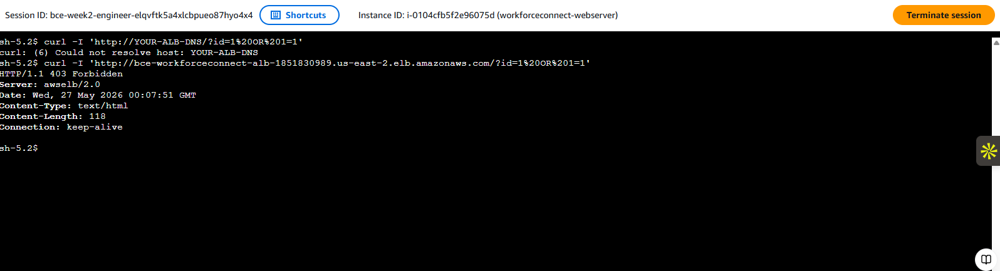

---

# Security Features Added During Week 3

The following enterprise-style protections and networking upgrades were implemented during the security phase of the project:

- SQL Injection Filtering
- Layer 7 Request Inspection
- AWS Managed WAF Rules
- Bot Traffic Protection
- Reverse Proxy Architecture
- Target Health Monitoring
- Traffic Distribution Through ALB
- Controlled Security Group Access
- HTTP Request Filtering
- Load Balanced Architecture
- Production Request Routing

---

# Skills Demonstrated

## Cloud Engineering
- Cloud Infrastructure Deployment
- AWS Networking
- Linux Server Administration
- Production Flask Hosting
- Reverse Proxy Configuration
- Load Balancer Deployment
- Full Stack Cloud Connectivity

## Cloud Security
- AWS WAF Deployment
- SQL Injection Protection
- Layer 7 Security Controls
- Traffic Filtering
- Security Group Hardening
- Web Application Security Testing
- Threat Mitigation Validation

## DevOps & Operations
- Git Version Control
- GitHub Repository Management
- Infrastructure Troubleshooting
- Health Check Monitoring
- Production Traffic Routing
- Cloud Architecture Design

---

# Architecture Summary

## Week 2 Architecture

User → EC2 → Flask/Gunicorn → RDS

This initial deployment provided a functional cloud-hosted web application using AWS compute and database infrastructure.

---

## Week 3 Architecture

User → AWS ALB → AWS WAF → NGINX → Gunicorn → Flask → RDS

This upgraded architecture introduced production-grade networking, request routing, traffic filtering, and web application firewall protections commonly used in enterprise cloud environments.

---

# Key Accomplishments

- Built and deployed a Flask application on AWS
- Configured Linux-based EC2 infrastructure
- Integrated Flask application with Amazon RDS MySQL
- Configured Gunicorn production server
- Implemented NGINX reverse proxy
- Built AWS Application Load Balancer architecture
- Configured AWS Target Groups and health monitoring
- Hardened AWS Security Groups
- Implemented AWS WAF protections
- Successfully validated SQL injection filtering
- Managed source control and documentation with GitHub
- Simulated enterprise-style production cloud architecture

---

# Author

Theodore King
A SQL injection style payload was tested against the application:

```bash
?id=1%20OR%201=1
