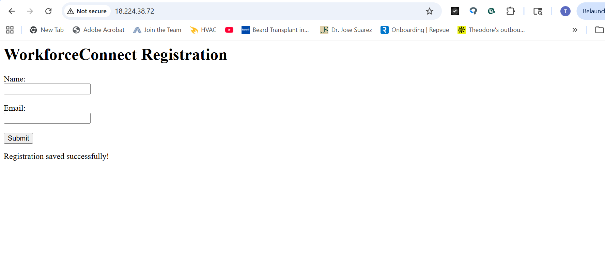

# WorkforceConnect AWS Deployment

A cloud-hosted registration application deployed on AWS using Flask, Amazon EC2, Amazon RDS MySQL, Gunicorn, Linux, and GitHub.

---

# Project Overview

This project demonstrates a real-world cloud deployment workflow by hosting a Python Flask application on AWS infrastructure with persistent MySQL database storage.

The application allows users to submit registration information through a live web form, which is then stored in an Amazon RDS MySQL database.

---

# Technologies Used

- AWS EC2
- AWS RDS MySQL
- AWS VPC Networking
- Security Groups
- Flask
- Gunicorn
- Linux (Amazon Linux 2023)
- MySQL
- Git & GitHub

---

# Live Application

---

# Gunicorn Production Service

---

# AWS RDS Database

---

# Database Validation

---

# GitHub Deployment Validation

---

# Skills Demonstrated

- Cloud Infrastructure Deployment
- Linux Server Administration
- Production Flask Hosting
- Database Integration
- AWS Networking & Security
- Git Version Control
- Troubleshooting & Debugging
- Full Stack Cloud Connectivity

---

# Architecture Summary

- EC2 hosts the Flask application
- Gunicorn serves the production application
- Amazon RDS stores registration data
- Security groups restrict database access
- GitHub stores version-controlled source code

---

# Author

Theodore King
